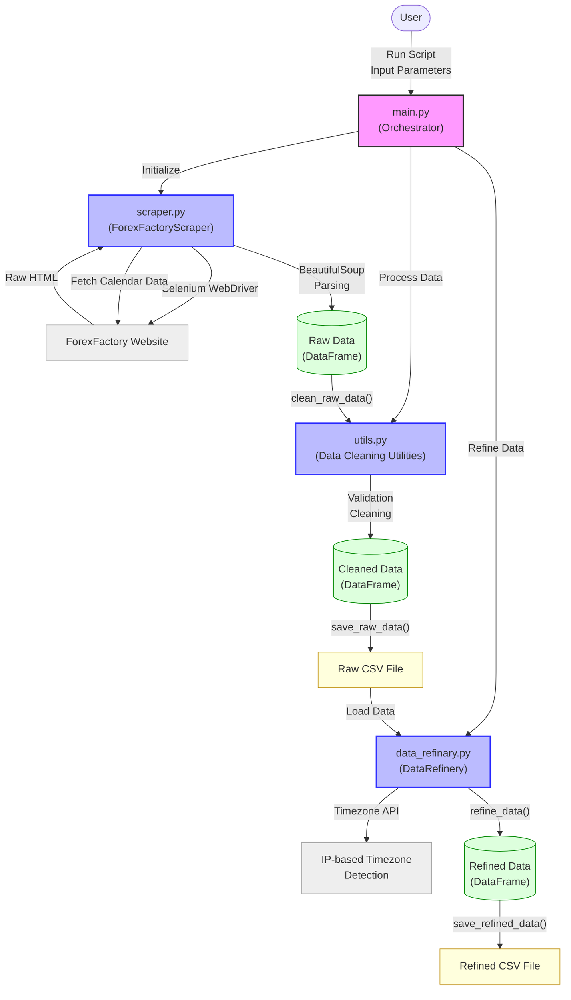
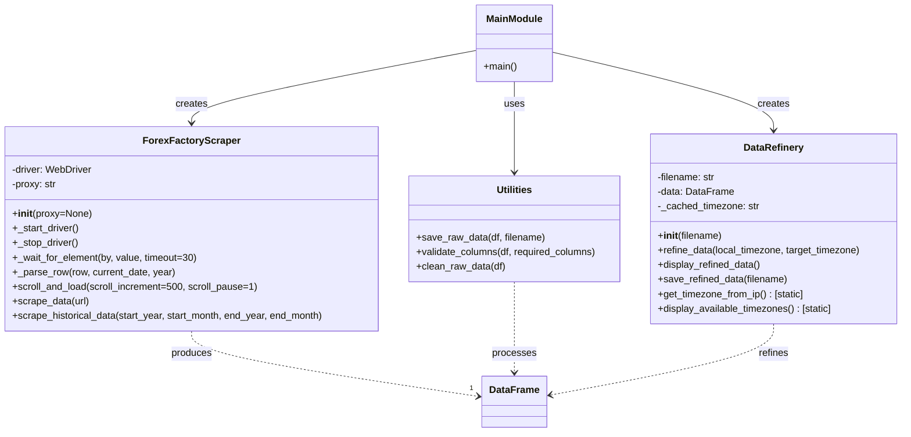
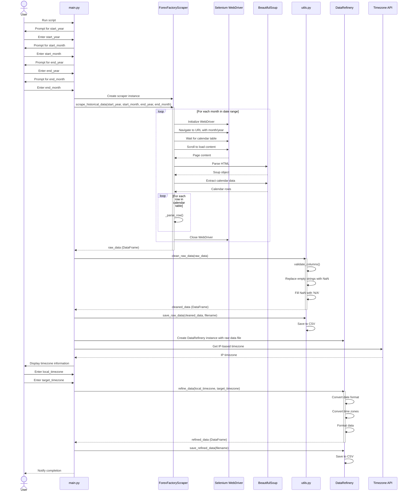
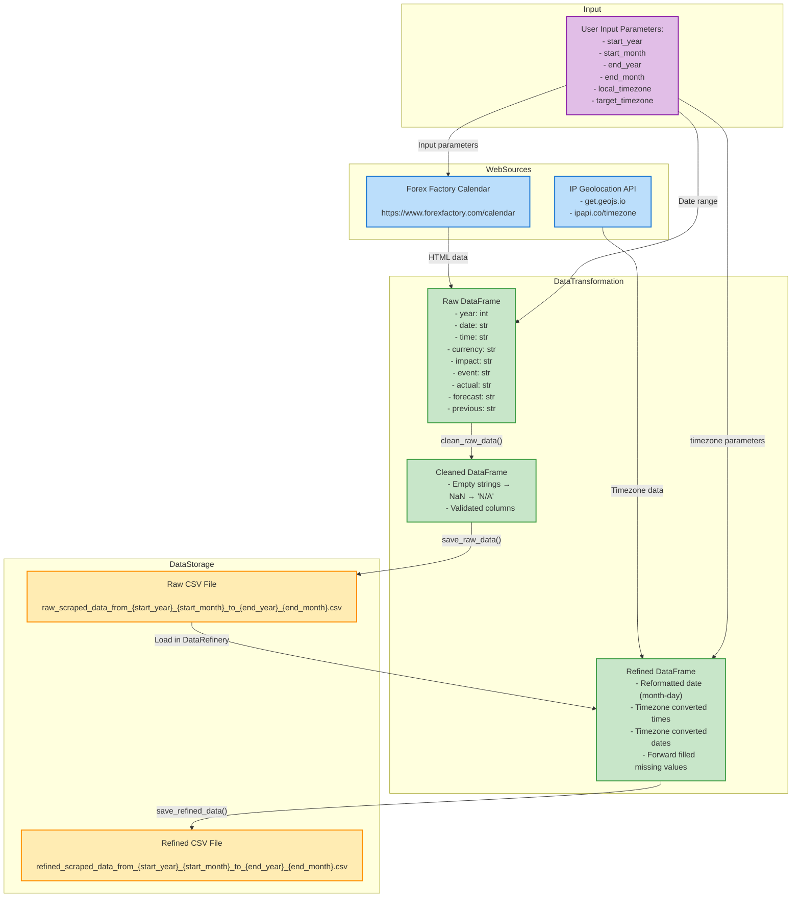

# ForexFactory Scraper

Unlock the power of historical economic data with the ForexFactory Scraper! This Python bot, built with Selenium and BeautifulSoup, helps you gather and analyze historical forex calendar data from ForexFactory.

## System Architecture

The Forex Factory Scraper is designed with a modular architecture for maintainability and extensibility. Each component has a specific responsibility in the data scraping and processing pipeline.

### System Overview Diagram


### Class Structure


### Process Flow


### Data Flow


## Key Components

### 1. ForexFactoryScraper (scraper.py)
The core web scraping component:
- Uses Selenium WebDriver with anti-detection measures (random user agents, headless mode)
- Implements explicit waits for reliable element loading
- Extracts calendar data with BeautifulSoup parsing
- Supports month-by-month scraping over a date range
- Handles pagination and dynamic content loading

### 2. Data Cleaning Utilities (utils.py)
Handles data validation and cleaning:
- Validates required columns exist in the DataFrame
- Cleans raw data by converting empty strings to NaN
- Fills missing values with 'N/A' for consistency
- Provides functions to save raw data to CSV

### 3. DataRefinery (data_refinary.py)
Processes and transforms the scraped data:
- Reformats dates for consistency (month-day format)
- Converts timestamps between timezones
- Detects user's timezone from IP using geolocation APIs
- Handles missing values with forward filling
- Saves the refined data to CSV files

### 4. Main Script (main.py)
Orchestrates the entire process:
- Validates user input parameters
- Handles the execution flow
- Coordinates between components
- Provides error handling and user feedback

## Requirements
- **Python 3.7+**: Because we believe in staying up-to-date!
- **Google Chrome**: The fastest way to browse the web.
- **ChromeDriver**: The magic behind the data scraping journey.
- **Internet connection for IP-based timezone detection**: This is necessary for the bot to detect your IP-based timezone and automatically configure the data scraping process.

## Installation
Getting started is a breeze! Follow these simple steps and you're on your way to mastering forex insights.

1. **Clone the Repository**: Begin your journey by cloning the repository.
```bash
git clone https://github.com/htooayelwinict/forexfactory_scraper.git
cd forexfactory_scraper
```

2. **Create a Python Virtual Environment**: Ensure you have a clean and isolated Python environment for your project.
```bash
python -m venv forex_factory_scraper_venv
source forex_factory_scraper_venv/bin/activate  # On Windows: forex_factory_scraper_venv\Scripts\activate
```

3. **Install Dependencies**: We've made the process seamless with a single command.
```bash
pip install -r requirements.txt 
``` 
or fix with chatgpt :P 

4. **Set Up Chrome Browser**: Ensure you have the latest version of Chrome installed.

## How to Use

1. **Run the Bot**: Let the adventure begin!
```bash
python main.py
```

2. **Input Data Range**: Select the start and end years and months for your data.
   - **Start Year**: Enter the start year (validates against future years)
   - **Start Month**: Enter the start month (1-12, validates against future months)
   - **End Year**: Enter the end year (must not be before start year)
   - **End Month**: Enter the end month (1-12)

3. **Configure Timezones**:
   - **Local Timezone**: The script automatically detects:
     - Your IP-based timezone
     - Your system timezone
   - **Target Timezone**: You can choose:
     - Local timezone (defaults to IP-based if left empty)
     - Target timezone for data conversion

4. **Output Files**:
Two CSV files will be generated:
   - `raw_scraped_data_from_YYYY_MM_to_YYYY_MM.csv` (original data)
   - `refined_scraped_data_from_YYYY_MM_to_YYYY_MM.csv` (timezone-adjusted data)

## Data Structure

### Raw Data Columns
- **year**: Year of the event
- **date**: Date in "Day Month Day_number" format (e.g., "Mon Jan 1")
- **time**: Time of the event in local timezone
- **currency**: Currency code affected by the event
- **impact**: Expected impact level (High, Medium, Low)
- **event**: Economic event name
- **actual**: Actual value reported
- **forecast**: Forecasted value
- **previous**: Previous reported value

### Refined Data Columns
- **year**: Year of the event (in target timezone)
- **date**: Date in "month-day" format (e.g., "1-15")
- **time**: Time converted to target timezone in 12-hour format
- **currency**: Currency code affected by the event
- **impact**: Expected impact level (High, Medium, Low)
- **event**: Economic event name
- **actual**: Actual value reported
- **forecast**: Forecasted value
- **previous**: Previous reported value

## Technical Features

1. **Robust Web Scraping**:
   - Anti-bot detection mechanisms
   - Scroll-and-wait strategy for dynamic content
   - Error handling for network issues

2. **Smart Timezone Management**:
   - Multiple fallback API endpoints for timezone detection
   - Error handling for API rate limits
   - Comprehensive timezone validation

3. **Data Quality Assurance**:
   - Input validation to prevent errors
   - Consistent handling of missing values
   - Error recovery mechanisms

## Important Notes
- The scraper only works with historical data (cannot scrape future dates)
- Timezone format examples: 'Asia/Singapore', 'America/New_York', 'Europe/London'
- For timezone verification, you can use: https://ipapi.co/json/

## Error Handling
The script includes comprehensive error handling for:
- Invalid date inputs
- Future date validation
- Timezone validation
- Data scraping and processing errors
- Network connection issues
- API rate limiting

## Acknowledgements
A big shoutout to Tech With Tim for the inspiration and guiding me through the art of web scraping.

## Get in Touch
We love hearing from fellow traders and tech enthusiasts! Connect with me:

- ***telegram*** @htooayelwin
- ***telegram*** @lewisaeofburma

## License
This project is licensed under the GNU General Public License v3.0, because we believe in open source and ensuring that no one uses this project for their benefit.

## Shoutout to KweeBoss and the 1BullBear Family!
We raise our hats to KweeBoss and the incredible 1BullBear Family for inspiring this project. May this tool serve you well as you navigate the exciting seas of forex trading! 🚀
